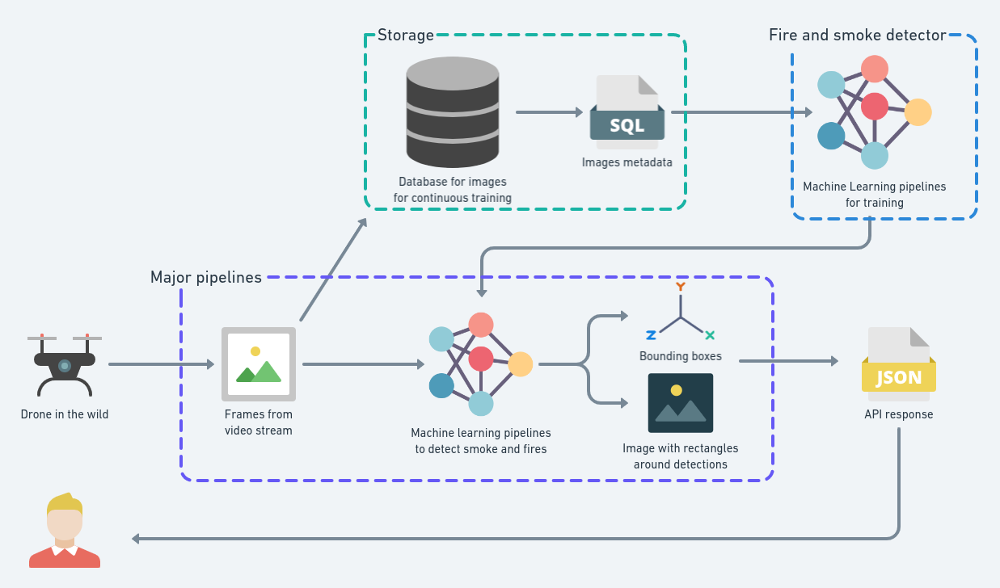

# Fire and smoke drone detection

Endpoint to detect and classify the presence of fire and smoke in a given image.


## Response
```
{
  "success": true,
  "detection": {
    "pred_boxes": [
      {
        "xmin": 0.28542792797088623,
        "ymin": 0.2093839943408966,
        "xmax": 0.6914964318275452,
        "ymax": 0.791353702545166
      }
    ],
    "pred_classes": [
      "smoke"
    ],
    "pred_scores": [
      0.938346266746521
    ]
  }
```

## License

[MIT](https://choosealicense.com/licenses/mit/)

## Overview

