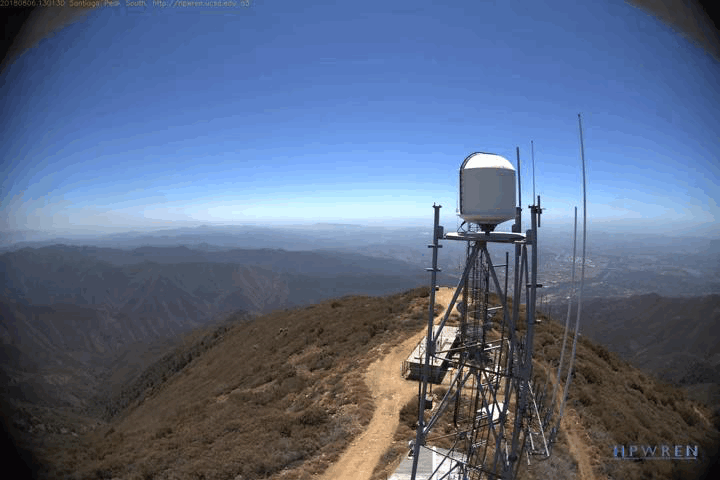

# Fire and smoke drone detection

Endpoint to detect and classify the presence of fire and smoke in a given image.



## Response
```
{
  "success": bool,
  "detection": {
    "classes": [str],
    "scores": [float],
    "boxes": {[float]
    }
  }
}
```

## License

[MIT](https://choosealicense.com/licenses/mit/)

## Overview

